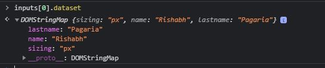

# JavaScript-30
 These are the small 30 JavaScript projects to brush up JavaScript Skills. This course I took from javaScript30.com by WebBos
## Drum Kit
Things I learned 
* The data-* attributes gives us the ability to embed custom data attributes on all HTML elements. To learn more https://www.w3schools.com/tags/att_global_data.asp
* Handling various Event Listeners like - keydown, click, keyup, transitionend etc.
* adding and removing the class when the transition gets over 
 * Adding the class
 ```javascript
 key.classList.add('playing');
 ```
 * Removing the class
```javascript
e.target.classList.remove("playing");
```
## Update_Variables Js
Things I learned
* Creating Variables using :root in CSS
```css
:root{
    --variable_name: value;
}
```
* setProperty method this basically takes 2 arguments (propertyName, value) and sets the property in the CSS
```javascript
document.documentElement.style.setProperty(`--${thi.name}`, thi.value+suffix);
```
* Used dataset property provides access to custom data attributes and returns a map so that you can access it. For e.g.
```html
<div class="controls">
            <label for="spacing">Spacing</label>
            <input type="range" name="spacing" min="10" max="200" value="100" data-sizing="px" data-name="Rishabh" data-lastname="Pagaria"><br>

            <label for="blur">Blur</label>
            <input type="range" name="blur" min="0" max="25" value="10" data-sizing="px"><br>

            <label for="base">Base Color</label>
            <input type="color" name="base" value="#ff0077">
        </div>
```
```javascript
const inputs = document.querySelectorAll('.controls input');
console.log(inputs[0].dataset)
```


